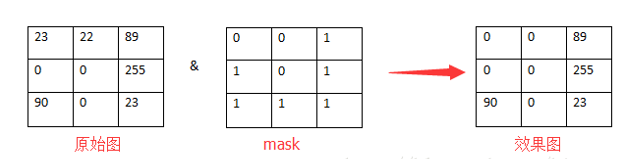
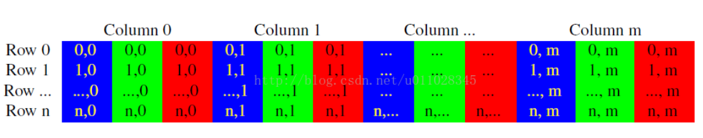

# 基本的图片载入和输出

- 详见[图像的载入，显示和输出 一站式完全解析](https://blog.csdn.net/poem_qianmo/article/details/20537737)

## 命名空间

* OpenCV的函数和类都在命名空间`cv`中

* 最常用：

    ```c++
    #include <opencv2/core/core.hpp>
    #include<opencv2/highgui/highgui.hpp>
    
    using namespace cv;
    ```

## Mat 类

* `cv::Mat`是用于保存图像以及其他矩阵数据的数据结构
* 详见[Opencv中Mat图的长、宽、行、列以及图像像素](https://blog.csdn.net/tkingreturn/article/details/38925231)

## 图像载入

图像载入需要用到函数`imread()`，其原型：

```c++
Mat imread(const string& filename, int flags=1 );
```

* 第一个参数为图像文件的路径名
* 支持的图像类型需要详查
* 第二个参数，int类型的flags，为载入标识
    - flags >0返回一个3通道的彩色图像(RGB)
    - flags =0返回灰度图像
    - flags <0以本来的格式读入

## 图像显示

### 创建窗口

`namedWindow()`函数，用于创建一个窗口

```c++
void namedWindow(const string& winname,int flags=WINDOW_AUTOSIZE );
```

* 第一个参数，const string&型的name，即填被用作窗口的标识符的窗口名称
* 第二个参数，int 类型的flags ，窗口的标识，可以填如下的值：
    * `WINDOW_NORMAL`设置了这个值，用户便可以改变窗口的大小（没有限制）
    * `WINDOW_AUTOSIZE`如果设置了这个值，窗口大小会自动调整以适应所显示的图像，并且不能手动改变窗口大小
    * `WINDOW_OPENGL`如果设置了这个值的话，窗口创建的时候便会支持OpenGL

### 显示图片

`imshow()`在指定的窗口中显示一幅图像

```c++
void imshow(const string& winname, InputArray mat);
```

*   第一个参数，const string&类型的winname，填需要显示的窗口标识名称
* 第二个参数，InputArray 类型（可视为Mat类）的mat，填需要显示的图像

## 输出图像到文件

输出图像到文件，我们一般都用`imwrite()`函数

```c++
bool imwrite(const string& filename,InputArray img, const vector<int>& params=vector<int>() );
```

* 第一个参数，const string&类型的filename，填需要写入的文件名就行了，带上后缀
* 第二个参数，InputArray类型的img，一般填一个Mat类型的图像数据就行了
* 第三个参数，const vector<int>&类型的params，表示为特定格式保存的参数编码
* 所支持的图像格式详见文档

# ROI区域图像叠加

* 详见[ROI区域图像叠加&初级图像混合 全剖析](https://blog.csdn.net/poem_qianmo/article/details/20911629)

## 定义ROI

* ROI就是对一个原始图像数据块中选择一块需要用到的区域释放之前的数据放入新的数据

两种定义方法：

* 定义左上角和行列宽度

    ```c++
    cv::Mat imageROI(image1,
    cv::Rect(image1.cols-image2.cols,
    image1.rows-image2.rows,
    image2.cols,image2.rows)); 
    ```

* 直接定义行和列的范围

    ```c++
    cv::Mat imageROI=src_image(cv::Range(src_image.rows - ins_image.rows, src_image.rows),/*行范围*/
      cv::Range(src_image.cols - ins_image.cols, src_image.cols));/*列范围*/
    ```


# 分离颜色通道&多通道图像混合

* 保存图像颜色信息的通道称为颜色通道

## 分离颜色通道

# note

* 掩膜操作（mask）

    首先我们从物理的角度来看看mask到底是什么过程。 在半导体制造中，许多芯片工艺步骤采用光刻技术，用于这些步骤的图形“底片”称为掩膜（也称作“掩模”），其作用是：在硅片上选定的区域中对一个不透明的图形模板遮盖，继而下面的腐蚀或扩散将只影响选定的区域以外的区域。 图像掩膜与其类似，用选定的图像、图形或物体，对处理的图像（全部或局部）进行遮挡，来控制图像处理的区域或处理过程

    


* Mat中的像素储存方式

    

# 参考

* [李大宝的专栏](https://blog.csdn.net/ab1322583838/article/list/2)
* [OpenCV入门教程](https://blog.csdn.net/zhmxy555/category_9262318.html)
