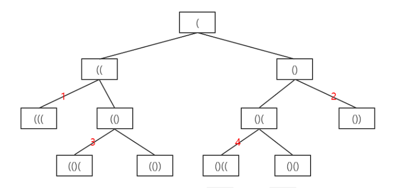
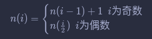
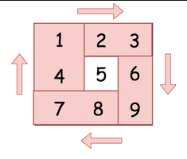
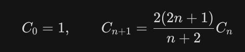
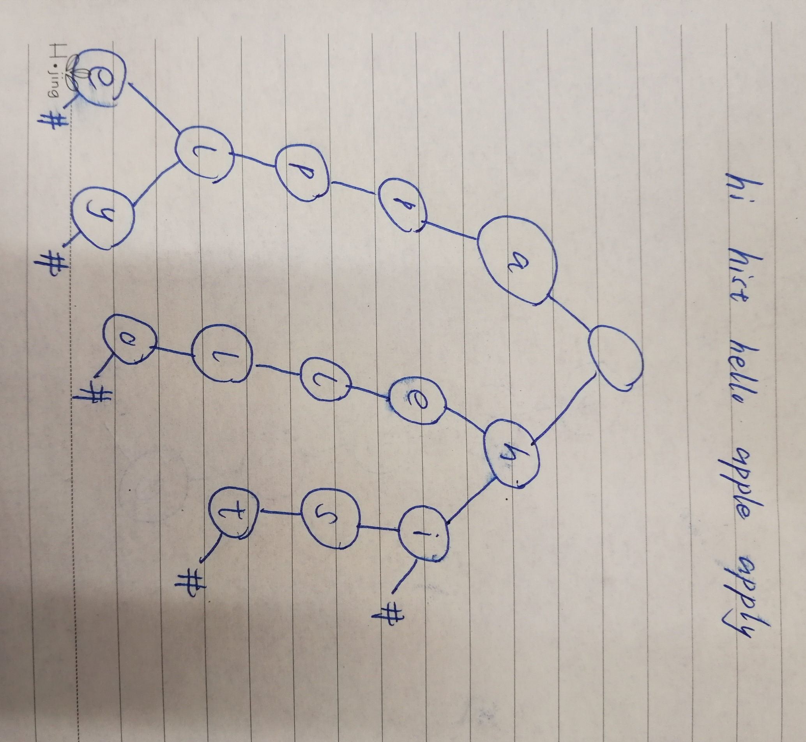
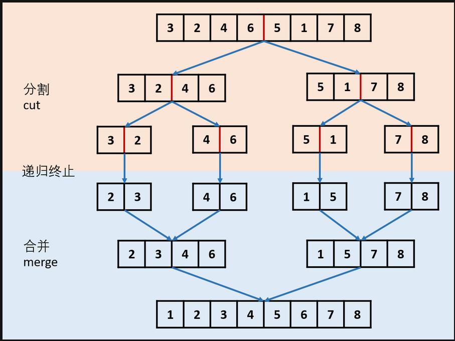

> 题目来源：[LeetCode Hot 100](https://leetcode-cn.com/problemset/leetcode-hot-100/)
>
> 题解来源：个人解法和LeetCode题解(没有对他人的题解注明，抱歉)

# 78.子集
[题目](https://leetcode-cn.com/problems/subsets/)

## 迭代法

```python
class Solution:
    def subsets(self, nums: List[int]) -> List[List[int]]:
        ans=[[]]
        for x in nums:
            ans+=[[x]+i for i in ans]
        return ans
```
对于`nums=[1,2,3]`
图示如下：

``` 
[]
[] [1]
[] [1] [2] [1,2]
[] [1] [2] [1,2] [3] [1,3] [2,3] [1,2,3]
```

## 库函数法

```python
class Solution:
    def subsets(self, nums: List[int]) -> List[List[int]]:
        ans=[]
        for i in range(len(nums)+1):
            for x in itertools.combinations(nums, i):
                ans.append(x)
        return ans
```

`itertools.combinations(i,n)`函数返回一个迭代器，包含序列i中长度为n的子序列

## *回溯算法*

```python
class Solution:
    def subsets(self, nums: List[int])-> List[List[int]]:
        ans=[]
        n=len(nums)
        
        def helper(i:int,temp:List[int]):
            ans.append(temp)
            for j in range(i,n):
                helper(j+1,temp+[nums[j]])
        helper(0,[])
        return ans
```

# 617. 合并二叉树
[题目](https://leetcode-cn.com/problems/merge-two-binary-trees/)

## 递归

```python
class Solution:
    def mergeTrees(self, t1: TreeNode, t2: TreeNode) -> TreeNode:
        if not t1 or not t2:
            return t1 or t2
        t1.val=t1.val+t2.val
        t1.left=self.mergeTrees(t1.left,t2.left)
        t1.right=self.mergeTrees(t1.right,t2.right)
        return t1
```

如果两个节点都不空，递归调用即可；如果有空的，则返回非空的那个（都空返回None）

如果不改变原树的元素，可以这样写：

```python
class Solution:
    def mergeTrees(self, t1: TreeNode, t2: TreeNode) -> TreeNode:
        if t1==None and t2==None:
            return None;
        else:
            x=t1.val if t1 else 0
            y=t2.val if t2 else 0
            return_node=TreeNode(x+y)
            return_node.left=self.mergeTrees(t1 and t1.left,t2 and t2.left)
            return_node.right=self.mergeTrees(t1 and t1.right,t2 and t2.right)
        return return_node   
```

# 461. 汉明距离
[题目](https://leetcode-cn.com/problems/hamming-distance/)

## 异或

```python
class Solution:
    def hammingDistance(self, x: int, y: int) -> int:
    	return bin(x^y).count("1")
```

异或，相同的位为0，不同的位为1；`bin()`把int型转为二进制，用字符串表示

## 移位法

同样利用异或，但是这里通过移位法计算1的个数

```python
class Solution:
    def hammingDistance(self, x: int, y: int) -> int:
        xor=x^y
        ans=0
        while xor:
            if xor & 1:
                ans+=1
            xor>>=1
        return ans
```


# 226. 翻转二叉树
[题目](https://leetcode-cn.com/problems/invert-binary-tree/)

## 递归法

```python
class Solution:
    def invertTree(self, root: TreeNode) -> TreeNode:
        if  root==None or (root.right==None and root.left==None):
            return root
        root.left,root.right=self.invertTree(root.right),self.invertTree(root.left)
        return root
```

节点为空或者没有子节点，直接返回该节点（因为不需要翻转子节点）；若有子节点，则对子节点分别翻转，之后交换两个节点即可（利用解包操作）

# 46. 全排列
[题目](https://leetcode-cn.com/problems/permutations/)

## 库函数法

```python
class Solution:
    def permute(self, nums: List[int]) -> List[List[int]]:
    	return list(itertools.permutations(nums))
```

`itertools.permutations(i)`返回可迭代对象i的全排列

## 回溯法

```python
class Solution:
    def permute(self, nums: List[int]) -> List[List[int]]:
        def full_permutation(nums: List[int],start: int=0):
            if start==len(nums)-1:
                ans.append(nums.copy())
            else:
                i=start
                while i<len(nums):
                    nums[start],nums[i]=nums[i],nums[start]
                    full_permutation(nums,start+1)
                    nums[start],nums[i]=nums[i],nums[start]
                    i+=1
                    
        if nums==None:
            return None
        ans=list()
        full_permutation(nums)
        return ans 
```

`while`循环是核心；全排列就是从第一个数字起每个数分别与它后面的数字交换


# 22. 括号生成
[题目](https://leetcode-cn.com/problems/generate-parentheses/)

## 回溯法

```python
class Solution:
    def generateParenthesis(self, n: int) -> List[str]:
        res=list()
        def backtrack(left:int,right:int,s:str):
            if left>n or left<right:
                return
            elif (left+right)==2*n:
                res.append(s)
                return
            backtrack(left+1,right,s+'(')
            backtrack(left,right+1,s+')')
            return
        backtrack(0,0,"")
        return res
```

易知最左边的括号必是`(`。从这里开始逐步增加`(或)`，增加后有以下情况：

* 先考虑无效情况，

    * 左括号数大于n（即一半括号数），这种情况肯定不行
    * 左括号数小于右括号数，无法达成有效，也不行

* 排除以上无效情况后，剩下的情况都是继续增加括号也可能有效的：

    * 如果两括号数目和为2n，则为结果
    * 如果数目还不够，则继续增加括号，这回产生加左和右两种结果的递归调用

其递归调用结构如下：



# 338. 比特位计数
[题目](https://leetcode-cn.com/problems/counting-bits/)

## 库函数法

```python
class Solution:
    def countBits(self, num: int) -> List[int]:
        return [(bin(x)).count("1") for x in range(num+1)]
```

类似[461. 汉明距离](https://leetcode-cn.com/problems/hamming-distance/)，`bin()`函数返回一个数的二进制（字符串形式），在用`count()`方法计算1的个数即可；最后用列表构造式构造List即可

## 动态规划

二进制中1的个数规律如下：



```python
class Solution:
    def countBits(self, num: int) -> List[int]:
        if num == 0:
            return [0]
        res=[0]
        for i in range(1,num+1):
            if i%2==0:
                res.append(res[i//2])
            else:
                res.append(res[i-1]+1)
        return res
```


# 104. 二叉树的最大深度
[题目](https://leetcode-cn.com/problems/maximum-depth-of-binary-tree/)

## 递归

```python
class Solution:
    def maxDepth(self, root: TreeNode) -> int:
        if root==None:
            return 0
        else:
            return 1+max(self.maxDepth(root.left),self.maxDepth(root.right))
```

若节点为空，则深度为1；不空，则深度为深度最大的子节点的深度加1

## 广度优先搜索

```python
class Solution:
    def maxDepth(self, root: TreeNode) -> int:
        if not root:
            return 0
        q=deque([root])
        d=0
        while q:
            size=len(q)
            while size>0:
                node=q.popleft()
                if node.left:
                    q.append(node.left)
                if node.right:
                    q.append(node.right)
                size-=1
            d+=1
        return d 
```

建立一个队列，根节点入队；每次出队一层，同时该层的子节点入队；队列为空时即可得层数


# 94. 二叉树的中序遍历
[题目](https://leetcode-cn.com/problems/binary-tree-inorder-traversal/)

## 递归

```python
class Solution:
    def inorderTraversal(self, root: TreeNode) -> List[int]:
        res=list()
        def tra(root:TreeNode):
            if root==None:
                return
            else:
                tra(root.left)
                res.append(root.val)
                tra(root.right)
        tra(root)
        return res
```

## 栈模拟

```python
class Solution:
    def inorderTraversal(self, root: TreeNode) -> List[int]:
        if not root:
            return []
        stack=list()
        res=list()
        node=root
        while node or stack:
            while node:
                stack.append(node)
                node=node.left
            node=stack.pop()
            res.append(node.val)
            node=node.right
        return res
```

创建一个栈：

* 根节点入栈，之后如果其左子节点存在，则每次都把左子节点入栈，直至没有左子节点后
* 弹出栈顶节点，记录，再把该节点的右子节点入栈，重复上述操作，直至栈和当前节点都为空


## 标记+栈模拟

```python
class Solution:
    def inorderTraversal(self, root: TreeNode) -> List[int]:
        WHITE,GRAY = 0, 1
        res=[]
        stack=[(WHITE, root)]
        while stack:
            color,node=stack.pop()
            if not node: 
                continue
            if color == WHITE:
                stack.append((WHITE, node.right))
                stack.append((GRAY, node))
                stack.append((WHITE, node.left))
            else:
                res.append(node.val)
        return res
```

做法来自[题解](https://leetcode-cn.com/problems/binary-tree-inorder-traversal/solution/yan-se-biao-ji-fa-yi-chong-tong-yong-qie-jian-ming/)：

* 使用颜色标记节点的状态，新节点为白色，已访问的节点为灰色
* 如果遇到的节点为白色，则将其标记为灰色，然后将其右子节点、自身、左子节点依次入栈
* 如果遇到的节点为灰色，则将节点的值输出
* 更换`color == WHITE`判断后的如栈顺序，可以完成前，中，后序遍历

# 39. 组合总和
[题目](https://leetcode-cn.com/problems/combination-sum/)

## 回溯法
```python
class Solution:
    def combinationSum(self, candidates: List[int], target: int) -> List[List[int]]:
        res=[]
        candidates_copy=sorted(candidates)
        def find(ind,nums,tar):
            for i in range(ind,len(candidates)):
                n=candidates_copy[i]
                if tar==n:
                    res.append(nums+[n])
                if tar>n:
                    find(i,nums+[n],tar-n)
                if tar<n:
                    return
        find(0,[],target)
        return res
```
先对原数组排序，方便接下来的组合操作

从原数组的第一个元素开始添加，如果添加后仍为达到target，则继续对每个元素再进行添加

当第一个元素执行完上操作，对下一个元素执行；由于数组是排序过的，这种搜索方式可以避免重复的组合

# 114. 二叉树展开为链表

[题目](https://leetcode-cn.com/problems/flatten-binary-tree-to-linked-list/)

## 前序遍历储存位置

```python
class Solution:
    def flatten(self, root: TreeNode) -> None:
        """
        Do not return anything, modify root in-place instead.
        """
        l=list()
        def fun(node: TreeNode)->None:
            if not node:
                return
            else:
                l.append(node)
                fun(node.left)
                fun(node.right)
        fun(root)

        r=root
        for i in range(1,len(l)):
            r.left=None
            r.right=l[i]
            r=l[i]    
```

先用前序遍历存储每个树节点

遍历存储的列表，使每一个节点的右子节点是下一个元素

同时要注意把左子节点设置为`None`

## 寻找前驱法

```python
class Solution:
    def flatten(self, root: TreeNode) -> None:
        curr=root
        while curr:
            if curr.left:
                predecessor=nxt=curr.left
                while predecessor.right:
                    predecessor=predecessor.right
                predecessor.right = curr.right
                curr.left = None
                curr.right = nxt
            curr=curr.right
```

 对于每个节点：

* 不存在左子节点，则说明该节点和其右子节点是按照链表的顺序排列的，继续判断右子节点
* 存在左子节点，需要把右子节点挂到前驱节点（即该节点按前序遍历顺序时的上一个节点），同时使左子节点成为右子节点（注意最后使左子节点为空）


# 238. 除自身以外数组的乘积
[题目](https://leetcode-cn.com/problems/product-of-array-except-self/)

## 左右列表乘积
```python
class Solution:
    def productExceptSelf(self, nums: List[int]) -> List[int]:
        l=len(nums)
        L,R,res=[0]*l,[0]*l,[0]*l

        L[0]=1
        for i in range(1,l):
            L[i]=L[i-1]*nums[i-1]

        R[l-1]=1
        for i in reversed(range(l-1)):
            R[i]=nums[i+1]*R[i+1]

        for i in range(l):
            res[i]=L[i]*R[i]

        return res
```
解法来自[官方题解](https://leetcode-cn.com/problems/product-of-array-except-self/solution/chu-zi-shen-yi-wai-shu-zu-de-cheng-ji-by-leetcode-/)；
不能先累乘再做除法，因为可能包含0；同时先剔除每个元素，在对其他元素求积的话，会超时；这里选择用空间换时间的办法

对于每个元素的除自身以外的乘积，其实相当于元素左边的数组的累乘乘以元素右边数组的累乘；如果先储存了每个元素左右数组的类乘，就可以很快算出结果

元素左右数组的累乘是很好算的：

* 元素左边数组的累乘：对于第一个元素，规定其值1（因为其左边无元素）；对于第n个元素，其值为上一个累乘的结果乘以原数组中对应的元素，即`L[i]=L[i-1]*nums[i-1]`
* 同理，对于元素右边数组的累乘：最后一个元素，规定其值为1；对于第n个元素，其值`R[i]=R[i+1]*nums[i+1]`


示例如下：
```
nums [1,2,3,4]
  L  [1,1,2,6]
  R  [24,12,4,1]
```

# 206. 反转链表
[题目](https://leetcode-cn.com/problems/reverse-linked-list/)
## 迭代反转（返回新链表）
```python
class Solution:
    def reverseList(self, head: ListNode) -> ListNode:
        res=None

        node=head
        next_node=None
        while node:
            if not res:
                res=ListNode(node.val)
            else:
                res,res.next=ListNode(node.val),res
            node=node.next
        return res
```
从头遍历该链表，采用前插法建立一个新链表即可

## 原地反转
```python
class Solution:
    def reverseList(self, head: ListNode) -> ListNode:
        helper=ListNode(0)
        
        cur_node=head
        next_node=None
        while cur_node:
            next_node=cur_node.next
            cur_node.next=helper.next
            helper.next=cur_node
            cur_node=next_node
        return helper.next
```
类似上一个方法；这里创建一个头节点`helper`帮助反转；遍历链表，同时将每个节点插入至`helper`后即可

## 递归
```python
class Solution:
    def reverseList(self, head: ListNode) -> ListNode:
        if not head or not head.next:
            return head
        newhead = self.reverseList(head.next)
        head.next.next = head
        head.next = None
        return newhead
```
来自[题解](https://leetcode-cn.com/problems/reverse-linked-list/solution/shuang-zhi-zhen-di-gui-by-elevenxx/)
，这里以一个简单的实例分析递归：

```
1 -> 2 -> 3 -> 4 -> None
```

对1后的节点进行反转后：

```
1 -> 2 <- 3 <- 4 <- newhead
```

可见，此时需要将1的下一个节点（2）的下一个设置为其本身（即1本身），所以需要`head.next.next=head`
，同时需注意将1的下一个节点设置为`None`

# 136. 只出现一次的数字
[题解](https://leetcode-cn.com/problems/single-number/)

## `list.count`方法
```python
class Solution:
    def singleNumber(self, nums: List[int]) -> int:
        for i in nums:
            if nums.count(i)==1:
                return i
```
由题易知必存在唯一元素，所以通过`list.count`方法遍历寻找只存在一次的元素返回即可

## 利用集合
```python
class Solution:
    def singleNumber(self, nums: List[int]) -> int:
        return sum(set(nums))*2-sum(nums)
```
题目中的列表中的数字要么出现一次，要么出现两次，所以先把列表转化为集合，然后求和乘2,再减去原列表的元素和，结果就是那个唯一的元素

## 利用字典
```python
class Solution:
    def singleNumber(self, nums: List[int]) -> int:
        d={}
        for i in nums:
            if d. __contains__(str(i)):
                d[str(i)]+=1
            else:
                d[str(i)]=1
        for i,j in d.items():
            if j==1:
                return int(i)
```
字典存储每个数字出现的次数，最后输出值为1的键即可

## 位运算
```python
class Solution:
    def singleNumber(self, nums: List[int]) -> int:
        return reduce(lambda x, y: x ^ y, nums)
```
可以使用异或运算：

* 任何数和0做异或运算，结果仍然是原来的数
* 任何数和其自身做异或运算，结果是0
* 异或运算满足交换律和结合律

对数组中所有元素进行异或运算，结果就是那个唯一的元素


# 48. 旋转图像
[题目](https://leetcode-cn.com/problems/rotate-image/)
## 两次迭代
```python
class Solution:
    def rotate(self, matrix):
        n=len(matrix)
        for i in range(n//2): #第一层，圈数，从外至内的圈数，奇数不用处理，因为中间一个元素不用旋转
            for j in range(i, n-i-1): #第二层，需要旋转的元素index，具体见图
                num=matrix[n-1-j][i] #左下角->num
                matrix[n-1-j][i]=matrix[n-1-i][n-1-j] #右下角->左下角
                matrix[n-1-i][n-1-j]=matrix[j][n-1-i] #右上角->右下角
                matrix[j][n-1-i]=matrix[i][j] #左上角->右上角
                matrix[i][j]=num #num ->左上角
```


每次都移动一个边，把边分成四部分，交互每个部分的元素即可

(如果能用`numpy`的话就可以更方便，直接写出一个边框的交换的代码，让后用子矩阵递归就行了)

# 96. 不同的二叉搜索树
[题目](https://leetcode-cn.com/problems/unique-binary-search-trees/)

## 卡特兰数
```python
class Solution:
    def numTrees(self, n: int) -> int:
        C=1
        for i in range(n):
            C*=2*(2*i+1)/(i+2)
        return int(C)
```
[卡特兰数](https://baike.baidu.com/item/catalan/7605685?fr=aladdin)




# 208. 实现 Trie (前缀树)
[题目](https://leetcode-cn.com/problems/implement-trie-prefix-tree/)
## 利用字典实现
```python
class Trie:

    def __init__(self):
        """
        Initialize your data structure here.
        """
        self.dirc={}


    def insert(self, word: str) -> None:
        """
        Inserts a word into the trie.
        """
        tree=self.dirc
        for c in word:
            if c not in tree:
                tree[c]={}
            tree=tree[c]
        tree["#"]="#"


    def search(self, word: str) -> bool:
        """
        Returns if the word is in the trie.
        """
        tree=self.dirc
        for c in word:
            if c not in tree:
                return False
            tree=tree[c]
        return  True if  "#" in tree else False


    def startsWith(self, prefix: str) -> bool:
        """
        Returns if there is any word in the trie that starts with the given prefix.
        """
        tree=self.dirc
        for c in prefix:
            if c not in tree:
                return False
            tree=tree[c]
        return True
```

参考自[题解](https://leetcode-cn.com/problems/implement-trie-prefix-tree/solution/pythonjian-dan-shi-xian-by-powcai/)

实现方法如下：

* 这里每个树节点都使用字典来表示，字典的键就是子节点的值，键的值就是字节点
* 先建立一个根节点
* 插入时，判断根节点是否有子节点值为第一个字母的，没有就创建一个新的键，键为该字母，其值为一个新的空节点（字典）；有的话就向下一个字母迭代，直至最后一个字母；最后把该节点的一个键值对设为一个特殊值，表示该节点可以作为最后一个节点
* 查询时，迭代判断即可，要注意判断到最后时，检查节点是否能作为最后一个才行
* 查询前缀和查询类似，只不过不需要判断检查最后一个节点

实例：



# 105. 从前序与中序遍历序列构造二叉树
[题目](https://leetcode-cn.com/problems/construct-binary-tree-from-preorder-and-inorder-traversal/)

# 递归

```python
class Solution:
    def buildTree(self, preorder: List[int], inorder: List[int]) -> TreeNode:
        if not preorder:
            return None
        root=TreeNode(preorder[0])
        a=inorder.index(preorder[0])
        root.left=self.buildTree(preorder[1:a+1],inorder[0:a])
        root.right=self.buildTree(preorder[a+1:],inorder[a+1:])
        return root
```
* 前序遍历的第一个一定是根节点
* 从中序遍历中找到根节点（题目已经指明节点元素唯一），则左侧就是左子树的元素，右侧就是右子树的元素
* 已知右子树的元素个数，且右子树的元素在前序遍历中是连续排列在数组最后的，所以很容易在前序遍历中找到左，右子树
* 最后递归即可


# 64. 最小路径和
[题目](https://leetcode-cn.com/problems/minimum-path-sum/)

## 动态规划
```python
class Solution:
    def minPathSum(self, grid: List[List[int]]) -> int:
        sum=grid.copy()
        for i in range(len(grid)):
            for j in range(len(grid[0])):
                if i==j==0:
                    continue
                elif i==0:
                    sum[i][j]=sum[i][j-1]+grid[i][j]
                elif j==0:
                    sum[i][j]=sum[i-1][j]+grid[i][j]
                else:
                    sum[i][j]=min(sum[i-1][j],sum[i][j-1])+grid[i][j]
        return sum[-1][-1]
```
动态规划，再建立一个矩阵存储每个点距离左上角的最短距离即可

# 406. 根据身高重建队列
[题目](https://leetcode-cn.com/problems/queue-reconstruction-by-height/)

## 贪心算法
```python
class Solution:
    def reconstructQueue(self, people: List[List[int]]) -> List[List[int]]:
        if len(people) <= 1:
            return people
        people = sorted(people, key = lambda x: (-x[0], x[1]))
        new_people = [people[0]]
        for i in people[1:]:
            new_people.insert(i[1], i)
        return new_people
```
来自[题解](https://leetcode-cn.com/problems/queue-reconstruction-by-height/solution/406gen-ju-shen-gao-zhong-jian-dui-lie-tan-xin-suan/)

* 排序：
  * 按高度降序排列。
  * 在同一高度的人中，按 k 值的升序排列
* 逐个地把它们放在输出队列中，索引等于它们的 k 值

# 312.戳气球
[题目](https://leetcode-cn.com/problems/burst-balloons/)

## *动态规划*
```python
class Solution:
    def maxCoins(self, nums: List[int]) -> int:
        n = len(nums)
        points = [1] + nums + [1]
        dp = [[0] * (n + 2) for _ in range(n + 2)]

        for i in range(n, -1, -1):
            for j in range(i + 1, n + 2):
                for k in range(i + 1, j):
                    dp[i][j] = max(dp[i][j], dp[i][k] + dp[k][j] + points[i] * points[k] * points[j])
        return dp[0][-1]
```

# 148. 排序链表
[题目](https://leetcode-cn.com/problems/sort-list/)

## 归并排序
```python
class Solution:
    def sortList(self, head: ListNode) -> ListNode:
        if not head or not head.next:
            return head
        
        slow,fast=head,head.next
        while fast and fast.next:
            fast,slow=fast.next.next,slow.next
        mid,slow.next= slow.next,None

        left,right=self.sortList(head),self.sortList(mid)
        h=res=ListNode()
        while left and right:
            if left.val < right.val:
                h.next,left=left,left.next
            else: 
                h.next,right=right,right.next
            h=h.next
        h.next=left if left else right
        return res.next
```



* 先用快慢指针找到链表中点
* 递归地分割链表
* 递归地连接分割的链表（创建空的头节点，将两个子链表的每个节点按顺序连接）

# 287.寻找重复数
[题目](https://leetcode-cn.com/problems/find-the-duplicate-number/)

## 利用字典
```python
class Solution:
    def findDuplicate(self, nums: List[int]) -> int:
        d={}
        for i in nums:
            if str(i) in d:
                d[str(i)]+=1
            else:
                d[str(i)]=1
        for i,v in d.items():
            if v>1:
                return int(i)
```

利用字典存储每个数字出现的次数，输出出现次数大于1的数字即可


## 快慢指针法
```python
class Solution:
    def findDuplicate(self, nums: List[int]) -> int:
        s,f=0,0
        while True:
            s=nums[s]
            f=nums[nums[f]]
            if f==s:
                break
        s=0
        while True:
            s=nums[s]
            f=nums[f]
            if f==s:
                break
        return s
```
类似于环形链表的找环节点的操作

首先，由题干，数组长度为$n+1$，说明其索引范围为$0- n$，而且其元素范围已给定为$1-n$，所以每个元素的值都是一个有效的索引

这可以理解为每个元素都指向了另一个元素，但是有的元素被多个元素所指向（同时也有元素没有被任何元素所指向），因此由元素的指向连接而成的链状结构是有环的，通过快慢指针就可以快速判断是否有环，即是否存在重复的元素


确定存在环后（即快慢指针相遇后），把慢指针放于数组首，再进行一次循环，这一次快，慢指针速度一样，每次都移动一步，当二者再次相遇时，相遇处就是重复的元素（其实很容易发现重复的元素就是环节点在链表结构中的前一个或后一个）


# 236. 二叉树的最近公共祖先
[题目](https://leetcode-cn.com/problems/lowest-common-ancestor-of-a-binary-tree/)

## 递归
```python
class Solution:
    def lowestCommonAncestor(self, root: 'TreeNode', p: 'TreeNode', q: 'TreeNode') -> 'TreeNode':
        if not root or root == p or root == q: return root
        left = self.lowestCommonAncestor(root.left, p, q)
        right = self.lowestCommonAncestor(root.right, p, q)
        if not left: 
            return right
        if not right: 
            return left
        return root
```
来自[题解](https://leetcode-cn.com/problems/lowest-common-ancestor-of-a-binary-tree/solution/236-er-cha-shu-de-zui-jin-gong-gong-zu-xian-hou-xu/)

节点元素唯一，两个节点的关系如下：
* 一：分别在最近公共祖先的左右子树里
* 二：其中一个在另一个的子树里

如果根节点和其中一个元素相等，那么返回这个节点（对应关系二）

如果不等，则需要对左右子树分别递归判断


# 739. 每日温度
[题目](https://leetcode-cn.com/problems/daily-temperatures/)

## 单调栈
```python
class Solution:
    def dailyTemperatures(self, T: List[int]) -> List[int]:
        stack=[]
        res=T.copy()
        for i in reversed(range(len(T))):
            while len(stack) and T[stack[-1]]<=T[i]:
                stack.pop()
            res[i]=stack[-1]-i if len(stack) else 0
            stack.append(i)
        return res
```

维护一个栈，存储元素的下标，之后数组反向迭代

如果栈为空，说明之后没有大于`T[i]`的元素，记`0`，同时 `i`进栈

如果栈不为空：

* 栈顶下标对应的元素大于`T[i]`，找到二者之差即为天数
* 如果小于等于`T[i]`，不断弹栈，之后如果大于，按上一个方法计算天数；如果栈为空，则记`0`
* `i`进栈