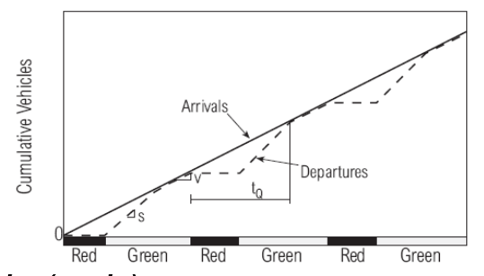

# uninterrupted flow

## volume and flow rate 

### volume

* volume:the **total number** of vehicles that pass over a
given point or section of a lane or roadway during **a given
time interval**.

* 通过对不同时间段取日平均值，可得年平均日交通量，月平均和周平均日交通量

* 高峰小时交通量：一天内高峰期间连续60分钟的交通量的最大值

* 高峰小时交通量占全天交通量之比为**高峰小时流量比**

* 第三十小时交通量：将一年所有小时的交通量从大到小排序，排第三十的那个小时的交通量

* 设计小时交通系数K：
    $$
    K=  \frac { 设计小时交通量（第三十小时交通量）} { 年平均日交通量}
    $$
    
* 注意：这里交通量和流量通常是一个含义 `(交通量 is 流量) == True`

### flow rate和volumn

* flow rate:the equivalent hourly rate at which vehicles pass over a given point or section of a lane or roadway **during a given time interval of less than 1 h, usually 15 min**.

* peak-hour factor(PHF)：
    $$
    PHF= \frac { hourly \   volumn} {peek \ flow \ rate}
    $$
    
* peak-hour factor：翻译成高峰小时系数属实nt，任何一个时间段都能算这个值而不只是高峰时间；这个值表达的是一个小时的交通量和这一小时内的最大流率的比值，通常可这样计算：
    $$
    PHF= \frac {V_{60min}} {4 \times {V_{15min}}}
    $$
    其实和上一个公式一样，$4 \times {V_{15min}}$就是该小时内的最大流率，只不过流量（或者说交通量）在时间上其实是不连续的，所以只能15分钟15分钟的算然后找最大的那个

* PHF通常小于1，因为每小时的流率总会有最大的那个时间段

* PHF有啥用？:一个路段的PHF通常是固定的，通过PHF和一段时间观察到的流量，就能算出这段时间的最大流率

* the defference between flow rate and volumn：flow rate是算出来的（先测再算），不是一个观测量；而volumn就是实际测出来的（或者说观察）

## 时间分布

* 月变化：一年内，各月的交通量的变化
* 月交通量系数：月平均日交通量/年平均日交通量
* 同月变化，可得周变化和时变化
* 日交通量系数：某星期的日均交通量/年平均日交通量
* 小时交通系数：某小时交通量/日均交通量

# speed

* 几种车速的定义：
    * 地点车速：车辆通过某个地点的瞬时速度
    * 行驶速度：车辆在某段区域行驶的平均速度
    * 运行车速：司机在安全路段和环境下的安全车速
    * 行程车速：某段行程的平均车速
    * 临界车速：道路理论通行能力达到时的最大车速
    * 设计车速：道路在环境条件良好时，车辆所达到的最大安全车速
* 车速频率分布：某一地点观察到的车辆速度的分布情况，85%位车速，50%位车速（中位车速），15%位车速

* Average running speed（平均行驶速度）：一段路的长度除以该路段所有车辆的平均行驶时间（该时间只包含运行，不包含车辆因外界影响停下的时间）
* Average travel speed（平均行程车速）：一段路的长度除以该路段所有车辆的平均运行时间（是包含停下和运动的总时间）（等于空间平均速度）

* Time mean speed（时间平均车速）：在道路某一点的车辆的瞬时速度的均值
    $$
    \bar V_t=\frac 1 n \sum_{i=1}^n V_i
    $$
    
* Space mean speed（空间平均车速）：路段长度除以该路段车辆行驶时间（包含停下）的平均值
    $$
    \bar V_s=\frac {s} {\frac {1}{n}\sum_{i=1} ^n t_i}=\frac {ns} {\sum_{i=1} ^n t_i}
    $$
    n：该段的车辆数

    $t_i$：第i辆车在该段的行驶时间

    s：路段长度
    
    空间平均速度总小于时间平均速度，随着速度的增加二者的差距减少，所以可以用时间平均速度近似表示空间平均速度（时间平均速度更容易测量）
    
* Free-flow speed：在一段低流量的道路上，所有车辆按驾驶员意愿随意开且不受交通规则约束下的平均速度

# density, spacing and headway

* density(K)：某一瞬间，一条车道单位长度上的车的数量，单位 辆/千米

    计算方式：车辆数（单车道）/路段长，流率/平均行驶速度，两种方法等价

* spacing（车头间距）：同列车流，前后车间的间距为车头间距，所有车的车头间距均值为平均车头间距$h_s$

* headway（车头时距）：同一列车流，前后车经过同一地点的时间间隔，同理也有平均车头时距$h_t$

$$
h_s(米/辆)=\frac {1000} {K(车流密度)(辆/千米)}
$$

$$
h_t(秒/辆)=\frac{3600} {Q(交通量)(量/小时)}
$$

$$
h_s=\frac {V(行驶速度)(km/h)}{3.6 }h_t
$$

* 长度占有率：一定长度的车道上，汽车总长所占的比率
* 时间占有率：某地点，一定时间，其中有车辆通过的时间所占的比率

# $D=\frac {v} {S}$

$$
D= \frac {v} {S} \\
K=\frac {Q}{V}
$$

该公式是连续流基本参数的关系式：

* D|K：车流密度
* v|Q：流率（或者流量）
* S|V：空间平均速度

* 极大流量$Q_m$是Q-V曲线上的峰值
* 临界速度$V_m$，即流量达到极大时的速度
* 最佳密度$K_m$，流量最大时的密度
* 阻塞密度$K_j$，速度几乎为0时的密度
* 畅行速度$V_f$，密度几乎为0时的速度
* 通常已知速度和密度的关系，这时利用公式算出三者关系即可；注意记没种模型的适用条件

# interrupted flow

* Saturation flow rate（饱和流率）：在一次连续的绿灯信号内，连续车流通过进口道的最大流量，单位pcu/h（pcu是单位车辆数，不同于veh，每辆车不一定算一个pcu，每种车的pcu都可能不同，需要换算）
    $$
    s=\frac {3600}{h}
    $$
    s：饱和流率

    h：饱和车头时距

    饱和流率代表一小时内路口全绿灯时，车流通过的数量

* delay（延误）： 由于交通摩阻与交通管制引起的
    行驶时间损失

* 延误率：车辆实际运行率与标准运行率之差

    运行率：车辆行驶一千米的时间（无延误时）

* 车辆延误率：一段车流的延误率的总和

* total start-up lost time（起步损失时间）：通常，车流在绿灯时，前几辆车因起步，其车头时距通常大于稳定的车流的车头时距，这些时间的和为起步损失时间

* clearance lost time（清空损失时间）：信号灯转换时，需要预留一些时间来使车辆完全停下，这个时间的和就是清空损失时间

*  排队长度：

    * 最大队长：$Q_M=\frac{vr}{3600}$

    * 平均队长：$Q_Q=\frac{vr}{3600}$

        v：平均到达率

        r：有效红灯时间

* 延误：

    * 总延误=总停车数×观测时间间隔，（车・s）（按面积差算）

        

    * 每辆停驶车辆的平均延误=$\frac{总延误}{停驶车辆数}$，（s）

    * 平均延误=$\frac{总延误}{车辆总数}$，（s）

    * 停驶车辆百分比：

        $$
        \frac{停驶车辆总数}{车辆总数}\times 100\%
        $$

    
    
